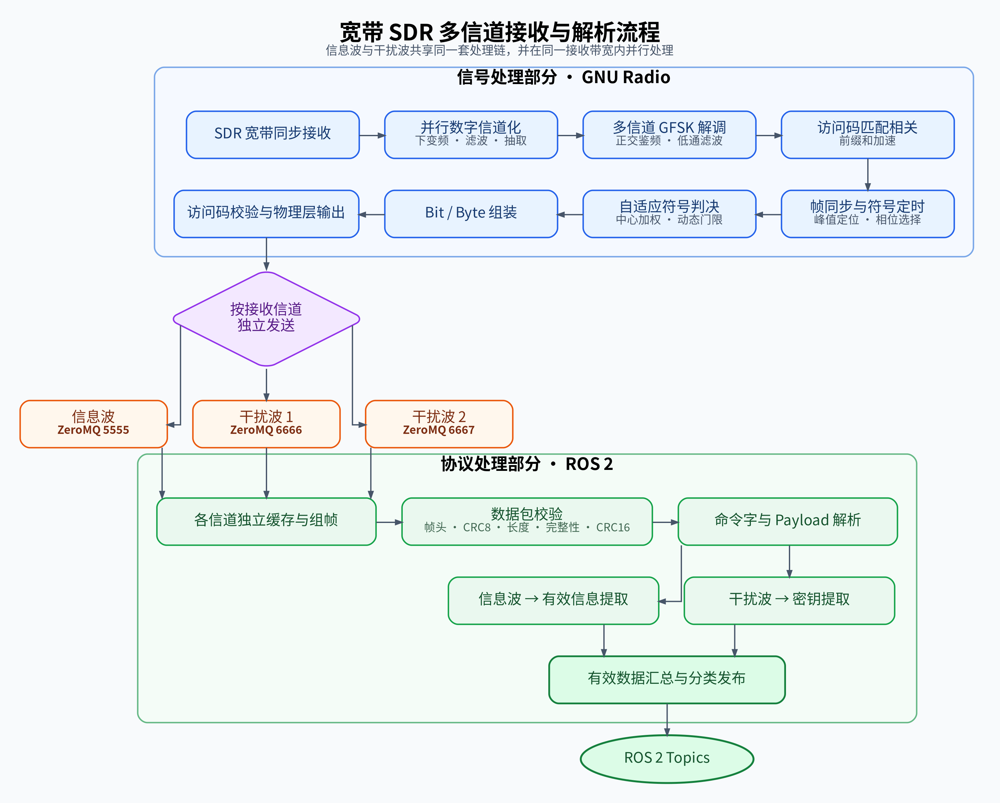

<div align="center">

# T-DT 2026 Radio

> 东北大学 T-DT 战队 RoboMaster 无线电接收与解码程序

<a href="https://neutdt.cn"></a>


<a href="LICENSE"></a>

<p align="center">
  
  
</p>

</div>

<br>

--------

<br>

<div align="left">

## 项目介绍

本项目是东北大学 T-DT 战队面向 RoboMaster 比赛开发的软件无线电接收与协议解析程序。

系统使用一台 SDR 接收设备采集宽带信号，在 GNU Radio 中并行完成多个频点的数字下变频、滤波、GFSK 解调和数据帧检测，再通过 ZeroMQ 将解调结果交给独立的 ROS 2 节点。ROS 2 节点负责数据重组、CRC 校验、协议解析，并向其他比赛模块发布强类型消息。

项目目前提供红方和蓝方两套接收流图。两套流图共用同一个 C++ 解调核心，只需要根据场地和设备调整射频中心频率、数字信道偏移、增益和检测门限。

## 工作流程

[]


## 项目优势

1. **前缀和加速互相关**
   使用 64 bit 访问码进行逐采样帧搜索，并通过符号极性前缀和快速计算相关分数。在 `sps=47` 时，朴素相关每个候选位置需要处理约 `64 × 47 = 3008` 个采样，前缀和方案的相关核心只需约 64 次区间累加。

2. **一台接收设备并行处理多个信道**
   SDR 只进行一次宽带采样，后续在软件中划分主数据和多个干扰信号支路。各信道共享同一硬件时钟，不需要为每个频点部署独立接收设备。

3. **GNU Radio 与 ROS 2 完全解耦**
   GNU Radio 专注射频和解调，ROS 2 专注协议和业务逻辑，两者通过本机 ZeroMQ PUB/SUB 通信。解调流图、协议解析和下游比赛模块可以分别调试、替换和重启。

4. **鲁棒的同步和符号判决**
   主接收块结合相关峰校准、最佳采样相位搜索、符号中心加权、高低电平自适应门限和帧内电平跟踪，降低幅度变化、采样偏差、符号边沿和随机噪声的影响。

5. **物理层容错，上层严格校验**
   物理层允许访问码存在少量 bit 错误，以保留弱信号候选帧；协议层再通过 `0xA5` 帧头、CRC8、长度范围和 CRC16 过滤误报。

## 核心技术与算法

本项目的主要创新由“宽带多信道并行接收架构”和“低复杂度实时解码算法”共同构成。宽带 SDR 和数字信道化负责同时获得多个不同频点，前缀和相关算法则降低各信道的访问码搜索开销，使信息波与干扰波能够在同一计算平台上实时并行解码。

### 基于宽带 SDR 的并行数字信道化

SDR 的一次宽带 IQ 采样同时覆盖信息波和多个携带密钥的干扰波。GNU Radio 使用多组数字下变频、FIR 信道滤波和抽取模块，将不同频点搬移到各自的基带，并构成多条并行接收信道。

与轮询扫描频率或为每个频点部署独立接收设备相比，该架构具有以下优势：

- 信息波与干扰波可以同时接收和解析，不会因频率切换漏失数据；
- 所有信道共享同一个 SDR 采样时钟，便于统一配置和维护；
- 一次射频采集即可同时得到有效信息和干扰波中的密钥；
- 新信道可以复用现有解调框架，通过修改频移量和检测参数进行扩展。

宽带并行接收属于系统架构，而不是单一算法。随着信道数量增加，逐采样帧搜索的计算量也会同步增长，因此需要低复杂度的访问码检测算法作为实时并行处理的算力基础。

### 基于符号极性前缀和的快速访问码相关搜索

信息波和干扰波分别使用以下 64 bit 访问码：

```text
信息波：0x2F6F4C74B914492E
干扰波：0x16E8D377151C712D
```

接收块先将鉴频后的浮点采样按极性转换成 `+1/-1`，再为每批输入建立前缀和：

```text
prefix[i + 1] = prefix[i] + sign(sample[i])
```

任意一个符号区间的极性累加值可以通过两个前缀和值相减得到：

```text
symbol_sum(begin, end) = prefix[end] - prefix[begin]
```

访问码在候选位置 `p` 的相关分数可表示为：

```text
score(p) = Σ kernel[bit] × symbol_sum(bit_begin, bit_end)
```

传统方法在每个候选位置需要重新处理约 `64 × SPS` 个采样；前缀和方法只需要计算约 64 个符号区间。在当前 `SPS=47` 时，相关核心的计算规模由约 3008 次采样累加降低为约 64 次区间计算，理论缩减约 47 倍。该数值描述的是相关核心的计算规模，不等同于程序整体运行速度提高 47 倍。

这种方法同时保留了两项优势：极性相关降低了绝对幅度变化对帧搜索的影响，较低的相关计算开销则为多个信道的实时并行检测提供了算力支撑。

### 粗细结合的帧同步与采样对齐

接收器首先以一个采样点为步长进行访问码滑动相关，完成帧的粗搜索。相关分数超过门限后，程序不会立即开始解码，而是在后续最多两个符号周期内继续寻找局部相关峰，以校正首次越过门限时产生的起点偏差。

主信息波接收块还会在理论采样位置前后约 `SPS/4` 的范围内搜索候选相位，并根据访问码错误 bit 数和最小判决裕量选择最佳采样位置。干扰波接收块目前使用相关峰对齐后的采样位置。

粗搜索、峰值校准和采样相位选择相结合，可以减少相关上升沿误触发及符号边沿采样造成的判决错误，提高帧头定位精度。

### 符号中心加权与自适应门限判决

帧起点确定后，接收器不会仅使用单个采样点进行判决，而是对每个符号的中间区域进行加权平均。越接近符号中心的采样权重越高，从而减小符号跳变边沿、瞬态噪声和轻微定时偏差的影响。

已知访问码用于分别估计当前帧的高、低电平，判决门限动态计算为：

```text
threshold = (high_level + low_level) / 2
```

Payload 解码过程中，接收器使用较小的学习率 `alpha=0.05` 跟踪高、低电平的缓慢变化。这种帧内自适应方式不依赖固定零门限，能够适应接收幅度和基线的变化，同时避免个别异常符号快速拉偏判决基准。

### 物理层容错与协议层严格校验

系统采用分层验证机制，在保留弱信号候选帧的同时，阻止错误数据进入应用层：

1. 使用 64 bit 访问码相关分数筛选候选帧；
2. Bit/Byte 组装后再次检查访问码汉明距离；
3. 信息波访问码最多允许 3 bit 错误，干扰波访问码最多允许 2 bit 错误；
4. 各 ZeroMQ 信道使用独立缓存完成连续字节流组帧；
5. 协议层统一执行 `0xA5` 帧头、CRC8、长度、完整性和 CRC16 校验；
6. 校验通过后再根据命令字和 Payload 长度提取有效信息或密钥。

这种设计可以概括为“物理层适度容错、协议层严格验证”：前端避免过早丢弃弱信号，后端通过完整的数据包校验保证 ROS 2 输出的可靠性。帧头或 CRC 校验失败后，缓存会继续搜索下一个合法帧头，实现连续数据流中的自动重新同步。

## 硬件条件

当前程序面向带有 libiio/GNU Radio IIO 支持的 SDR 接收设备开发，例如：

- ADALM-Pluto；
- FMComms2 或兼容设备；
- 能够覆盖目标频段并提供足够瞬时带宽的其他 SDR。

实际使用前需要根据设备修改 SDR URI/IP、采样率、增益和 AGC 模式。
在赛场上时使用 [微相 ANTSDR SDR 软件无线电]，天线为小胶棒。

## 项目结构说明

```text
.
├── GFSK_RX_RED.grc / .py        # 红方接收流图及生成程序
├── GFSK2_RX_BLUE.grc / .py      # 蓝方接收流图及生成程序
├── GFSK2_RX_TEST.grc / .py      # 接收算法测试流图
├── red.sh / blue.sh             # GNU Radio 与 ROS 2 启动脚本
├── test.py                      # ZeroMQ 主数据端口调试工具
├── docs/                        # 项目架构和信号处理流程图
├── LICENSE                      # 项目许可证
├── gr-robomaster/               # GNU Radio OOT 解调模块
│   ├── lib/                     # C++ 解调核心
│   ├── include/                 # C++ 公共接口
│   ├── python/                  # Python 绑定
│   └── grc/                     # GNU Radio Companion 块描述
└── src/
    ├── radio_recive/            # ZeroMQ、CRC、协议解析和 ROS 2 发布
    └── interface/radio_interface/ # 自定义 ROS 2 消息
```

## 模块介绍

| 模块 | 说明 |
| --- | --- |
| `GFSK_RX_RED` | 红方射频接收和多信道数字下变频流图 |
| `GFSK2_RX_BLUE` | 蓝方射频接收和多信道数字下变频流图 |
| `gfsk_receiver` | 主数据访问码搜索、相位选择和 GFSK 帧解码 |
| `gfsk_receiver_noise` | 干扰数据访问码搜索和 GFSK 帧解码 |
| `radio_recive` | ZeroMQ 数据重组、CRC 校验、协议解析和 ROS 2 发布 |
| `radio_interface` | 比赛数据的 ROS 2 自定义消息 |

## 依赖

- GNU Radio 及其开发文件，包含 IIO、ZeroMQ 和 Qt GUI 支持；
- ROS 2、colcon、ament 和 rosidl；
- CMake、C++17 编译器、Python 3、NumPy、pybind11；
- libiio、ZeroMQ / cppzmq；`test.py` 另外需要 PyZMQ。

## 编译

安装上述依赖后，先构建 GNU Radio OOT 模块，再构建 ROS 2 包。以下命令在仓库根目录使用 Bash 执行：

OOT 模块的详细构建、更新与卸载方法见 [gr-robomaster/README.md](gr-robomaster/README.md)。

```bash
git clone https://github.com/liuhansen1/RM_sdr.git
cd RM_sdr

# GNU Radio OOT 模块（系统安装方式）
cmake -S gr-robomaster -B gr-robomaster/build -DCMAKE_BUILD_TYPE=Release
cmake --build gr-robomaster/build --parallel
sudo cmake --install gr-robomaster/build
sudo ldconfig

# ROS 2 包
source /opt/ros/jazzy/setup.bash
colcon build --base-paths src --symlink-install
source install/setup.bash
```

Zsh 用户将 `setup.bash` 替换为 `setup.zsh`。`--base-paths src` 用于只构建 ROS 2 包，OOT 模块使用独立的 CMake 构建。

如果 GNU Radio 安装在自定义环境中，构建 OOT 时通过 `CMAKE_PREFIX_PATH` 和 `CMAKE_INSTALL_PREFIX` 指向该环境，并使用同一环境的 Python。安装后可检查接收块是否加载成功：

```bash
python3 -c "from gnuradio import robomaster; print(robomaster.gfsk_receiver, robomaster.gfsk_receiver_noise)"
```

## 运行

```bash
zsh red.sh    # 红方
zsh blue.sh   # 蓝方
```

运行前请在对应 GRC 流图中确认 SDR 地址、接收频率、增益和信道偏移，并重新生成对应的 `.py`。红、蓝接收程序使用相同的端口和 SDR，请一次只启动一套。

启动脚本默认检查当前用户的 `~/miniconda3`，存在时激活 `sdr` 环境；可通过 `CONDA_ROOT`、`CONDA_ENV_NAME`、`PYTHON_BIN` 覆盖。也可以分别在 GNU Radio 和 ROS 2 环境的终端中运行 `python3 GFSK_RX_RED.py`（蓝方为 `GFSK2_RX_BLUE.py`）和 `ros2 run radio_recive radio_recive_node`。

## 进程间通信接口

### ZeroMQ

| 端口 | 用途 |
| --- | --- |
| `5555` | 主数据帧 |
| `6666` | 干扰信道 1 |
| `6667` | 干扰信道 2 |
| `6668` | 可选干扰信道 3 |

各端口使用本机 TCP PUB/SUB。每个信道拥有独立缓存，上层解析器可以处理跨多条 ZeroMQ 消息到达的数据包。

### ROS 2

| Topic | 消息类型 | 用途 |
| --- | --- | --- |
| `/radio` | `std_msgs/msg/String` | 原始接收数据的十六进制字符串，用于调试 |
| `robot_position` | `radio_interface/msg/Position` | 机器人坐标 |
| `radio_hp` | `radio_interface/msg/Hp` | 机器人血量 |
| `radio_fire` | `radio_interface/msg/Fire` | 机器人弹药量 |
| `radio_state` | `radio_interface/msg/State` | 场地与机器人状态 |
| `radio_buff` | `radio_interface/msg/Buff` | Buff 与姿态数据 |
| `key_usart_sender` | `radio_interface/msg/Password` | 干扰密钥 |

## TODO

- 增加接收质量与数据内容的可视化输出。
- 通过读取比赛信息自动切换红蓝双方。

## 联系我们

| Email | QQ |
| --- | --- |
| [liuhansen026@gmail.com](mailto:liuhansen026@gmail.com) | 3978818034 |
